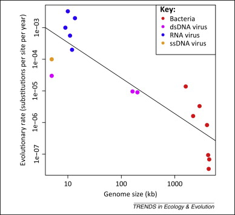
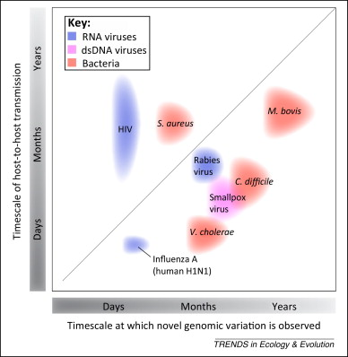

### Foundations of Evolutionary Theory and Population Genetics
[Darwinian evolution and natural selection applied to pathogens](https://cb3017.github.io/misc/2025/01/07/Darwinian-evolution-and-pathogens.html). [Hardy-Weinberg equilibrium and deviations in microbial populations. Mutation, migration, genetic drift, and selection in pathogen populations](https://cb3017.github.io/misc/2025/01/10/most-of-module-1.html). [Evolution of Antibiotic Resistance in Bacteria](https://cb3017.github.io/2025/01/13/intro-to-resistance.html).

#### Darwinian evolution and natural selection 

- [Galapagos Island](https://youtu.be/mcM23M-CCog)

#### Hardy-Weinberg equilibrium and deviations in microbial populations.

- [Explaining Hardy-Weinberg equilibrium using frog population by Amoeba Sisters](https://youtu.be/7S4WMwesMts?feature=shared)

#### Mutation, migration, genetic drift, and selection in pathogen populations.

- Horizontal Gene Transfer
	-. R. Craig MacLean, Alvaro San Millan ,The evolution of antibiotic resistance.Science365,1082-1083(2019).DOI:10.1126/science.aax3879
	- Short Introduction to [Horizontal Gene Transfer](https://bio.libretexts.org/Bookshelves/Introductory_and_General_Biology/General_Biology_(Boundless)/20%3A_Phylogenies_and_the_History_of_Life/20.03%3A_Perspectives_on_the_Phylogenetic_Tree/20.3B%3A_Horizontal_Gene_Transfer)
	- 

#### Evolution of Antibiotic Resistance in Bacteria
- [Baquero and Blazquez et al 1997](https://www.cell.com/action/showPdf?pii=S0169-5347%2897%2901223-8), [Adam et al 2008](https://link.springer.com/content/pdf/10.1186/1471-2148-8-52.pdf), [Martínez 2014](https://www.sciencedirect.com/science/article/pii/S174067491400002X/pdfft?md5=155a4a4f8e6697909d259903d7899f37&pid=1-s2.0-S174067491400002X-main.pdf), [Maclean and Millan 2019](https://www.science.org/doi/pdf/10.1126/science.aax3879), [Martínez et al 2021](https://pmc.ncbi.nlm.nih.gov/articles/PMC8404696/pdf/cmr.00050-19.pdf)
- [Evolutionary Rate in Prokaryotes](https://www.sciencedirect.com/science/article/pii/S0169534715000683/pdfft?md5=a007eff3004b420da9a44fb37b3a401f&pid=1-s2.0-S0169534715000683-main.pdf)
	- 
	- 

### References
1. Darwin and microbiology. Nat Rev Microbiol 7, 546 (2009).
2. Hartl, D.L., & Clark, A.G. (2007). Principles of Population Genetics.
3. Nei, M., & Kumar, S. (2000). Molecular evolution and phylogenetics. Oxford university press.
4. Saitou, N. (2013). Introduction to evolutionary genomics. London: Springer.